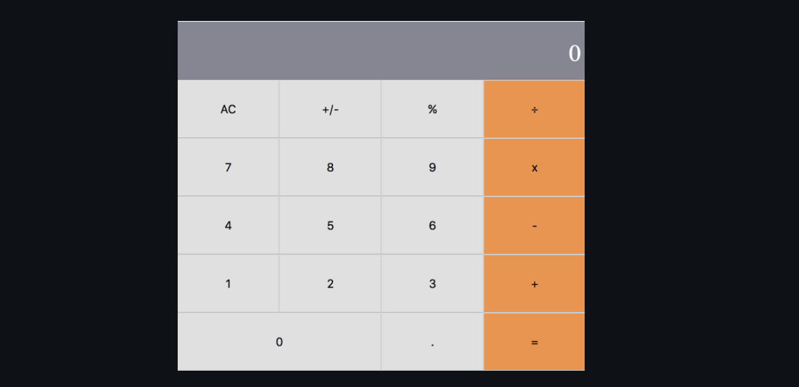

# Math Magicians

> Math-magicians is a website for all fans of mathematics. It is a Single Page App (SPA) that allows users to:
> Make simple calculations.
> Read a random math-related quote.

## Built With

- HTML, CSS, and JavaScript
- React
- git/GitHub

<!-- ## Live Demo

[Live Demo Link]() -->

### `Getting Started
To get a local copy up and running follow these simple example steps.

  - go to the directory that you want to clone the repository in.
  - right click and choose Git Bash here.
  - type "git clone https://github.com/BereketRetta/Math-Magician.git".
  - run "npm install" 
  - run "npm start"

## Author

👤 **Bereket**

- GitHub: [BereketRetta](https://github.com/BereketRetta)
- LinkedIn: [@BereketRetta](https://www.linkedin.com/in/bereket-retta/)

## 🤝 Contributing

Contributions, issues, and feature requests are welcome!

Feel free to check the [issues page](../../issues/).

## Show your support

Give a ⭐️ if you like this project!

## Acknowledgments

- Hat tip to anyone whose code was used
- Inspiration
- etc

## 📝 License

This project is [MIT](./MIT.md) licensed.
